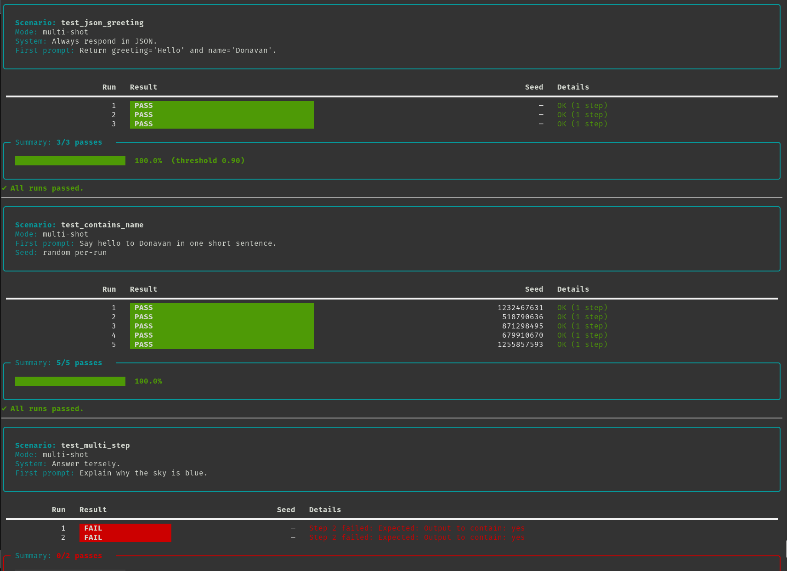

# speculate

**speculate** is a lightweight, Docker-ready **behavior-driven testing framework** for Large Language Models (LLMs).  
It helps you write **clear, structured specs** for how your LLM should behave, then validates actual responses.

Built by [Donavan White](https://github.com/digi-cazter) — powered with **Pydantic validation**, **rich CLI output**, and first-class support for **Ollama**.

---

## ✨ Features

- **BDD-style scenarios** with step chaining: define multiple `.prompt(...).expect_*(...)` steps.
- **System prompt support**: global or per-scenario.
- **Multi-shot control**:
  - `multi_shot(True)` (default): steps chain with conversation history per run.
  - `multi_shot(False)`: only the first step runs, no history passed.
- **Runs-per-test** and accuracy thresholds:
  - `.runs(N)` to repeat each scenario.
  - `.require_accuracy(0.9)` to enforce pass rates.
- **Seed management**:
  - Provider-level default seed.
  - Scenario override with `.seed(1234)`.
  - Randomize seeds per run with `.randomize_seed(True)`.
- **Raw output capture**:
  - `.dump_raw(mode="never|fail|always", to_dir="raw_outputs", file_format="txt|json")`.
- **Expectation types**:
  - Exact match, substring, regex, not equal, not contains, Pydantic schema.
- **Rich CLI output** with per-run tables, accuracy bars, and suite summary.
- **Dockerized runner**: reproducible, isolated environment.
- **Ollama integration**: works with `/api/chat` and falls back to `/api/generate`.

---

---

## 📂 Project Structure

```
speculate/
├─ __init__.py
├─ core.py                  # Scenario runner & summary (rich output)
├─ cli.py                   # CLI entrypoint
├─ providers/
│  ├─ __init__.py
│  └─ ollama_provider.py    # Provider wrapper for Ollama API
scenarios/                  # Example scenarios
models/                     # Example Pydantic models
requirements.txt
Dockerfile
docker-compose.yml
```

---

## 🚀 Quick Start

1. Ensure Ollama is running on your host:

```bash
ollama serve
ollama run mistral   # or another model, e.g. llama3.1, qwen2.5
```

2. Build and run tests in Docker:

```bash
docker compose build
docker compose up
```

Or run directly via the CLI:

```bash
python -m speculate.cli scenarios/
```

After packaging & install, you’ll get:

```bash
speculate scenarios/
```

---

## ⚙️ Configuration

Environment variables:

- `OLLAMA_BASE_URL`  
  Default: `http://host.docker.internal:11434`  
  Use the Ollama server base URL.

- `OLLAMA_API_STYLE`  
  Options:
  - `chat` → force `/api/chat`
  - `generate` → force `/api/generate`
  - `openai` → proxy-compatible `/v1/chat/completions`
  - *(default)* auto: try `/api/chat`, fall back to `/api/generate`.

- `OLLAMA_TIMEOUT_S`  
  Timeout in seconds (default 120).

- `LLM_DEFAULT_SEED`  
  Provider default seed.

- `LLM_RUNS_PER_TEST`  
  Default runs per scenario.

- `LLM_ACCURACY_THRESHOLD`  
  Suite-wide accuracy requirement.

- `LLM_RAW_DUMP`  
  `never` | `fail` | `always`.

- `LLM_RAW_DUMP_DIR`  
  Directory to save raw outputs.

---

## 🧪 Writing Tests

Scenarios go in `scenarios/*.py`. Each test chains prompts and expectations.

```python
from speculate import Scenario
from speculate.providers import OllamaProvider
from models.greeting import GreetingResponse

provider = OllamaProvider(model="mistral")

# JSON schema validation
Scenario("test_json_greeting", provider)
    .set_system_prompt("Always respond in JSON.")
    .prompt("Return greeting='Hello' and name='Donavan'.")
    .expect_schema(GreetingResponse, greeting="Hello", name="Donavan")
    .runs(3)
    .require_accuracy(0.9)
    .dump_raw(mode="fail", to_dir="raw_outputs", file_format="json")
    .run()

# Contains expectation, random seed per run
Scenario("test_contains_name", provider)
    .randomize_seed(True)
    .prompt("Say hello to Donavan in one short sentence.")
    .expect_contains("Donavan")
    .runs(5)
    .run()

# Multi-step chained prompts
Scenario("test_multi_step", provider)
    .set_system_prompt("Answer tersely.")
    .prompt("Explain why the sky is blue.")
    .expect_contains("Rayleigh")
    .prompt("Is that wavelength-dependent?")
    .expect_contains("yes")
    .runs(2)
    .run()

# Single-shot: ignores second step
Scenario("test_single_shot", provider)
    .multi_shot(False)
    .prompt("THIS runs")
    .expect_contains("THIS")
    .prompt("THIS will be ignored")
    .expect_contains("ignored")
    .runs(3)
    .run()
```

**Pydantic schema example:**

```python
# models/greeting.py
from pydantic import BaseModel

class GreetingResponse(BaseModel):
    greeting: str
    name: str
```

---

## 📊 Output Example

Each scenario prints:

- Header panel (scenario, mode, seed info, prompt preview).
- Per-run table (run #, PASS/FAIL badge, seed, details).
- Accuracy bar + threshold info.
- Suite summary at the bottom.

```
Scenario: test_json_greeting
Mode: multi-shot
Seed: random per-run

┏━━━━━┳━━━━━━━┳━━━━━━━━┳━━━━━━━━━━━━━━━━━━━━━━━━━━━━━┓
┃ Run ┃ Result┃ Seed   ┃ Details                     ┃
┡━━━━━╇━━━━━━━╇━━━━━━━━╇━━━━━━━━━━━━━━━━━━━━━━━━━━━━━┩
┃ 1   ┃ PASS  ┃  98765 ┃ OK (1 step)                 ┃
┃ 2   ┃ FAIL  ┃ 123456 ┃ Step 1 failed: Expected Hi  ┃
└─────┴───────┴────────┴─────────────────────────────┘

Summary: 1/2 passes ██████████░░░░░░░░  50.0%  (threshold 0.90)
✖ Some runs failed.
```

---

## 🛠 Extending

- Add other providers by implementing `generate(prompt, system_prompt, history, seed, **kwargs)`.
- Export `RESULTS` from `speculate.core` as JSON or JUnit for CI pipelines.
- Build fixtures for common prompts or expectations.
- Use `.expect_not_equal(...)` and `.expect_not_contains(...)` for negative checks.

---

## 📦 Packaging

- Editable install for development:

```bash
pip install -e .
speculate scenarios/
```

- Build & publish (requires `build` and `twine`):

```bash
python -m build
twine upload dist/*
```

---

## 📜 License

MIT License © 2025 Donavan White ([digi-cazter](https://github.com/digi-cazter))
